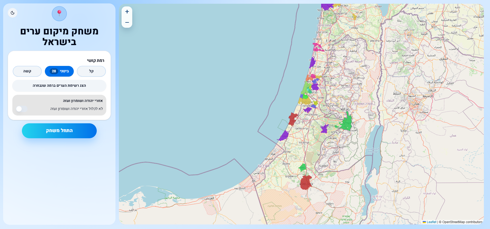
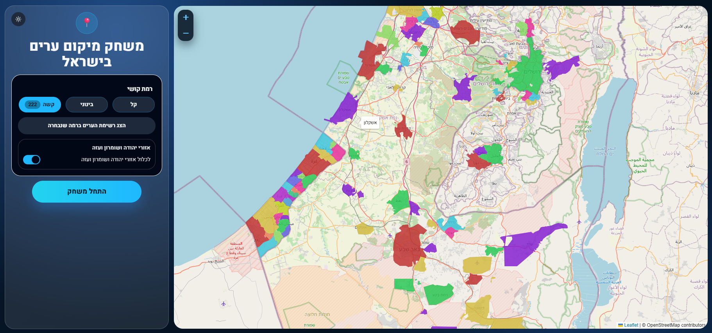
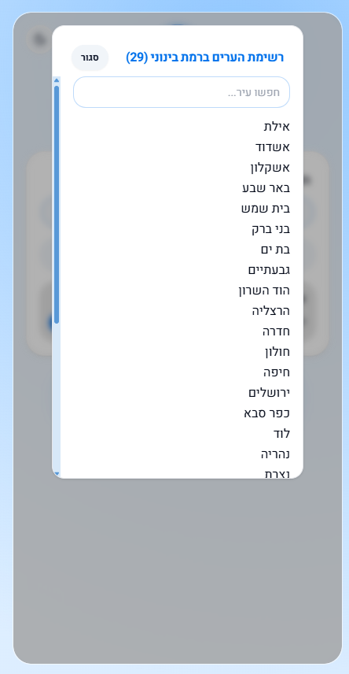
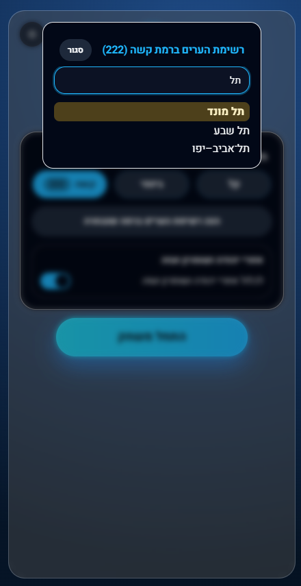
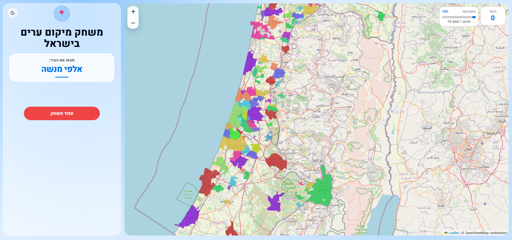
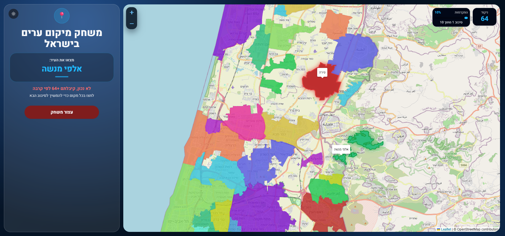

#  Israel Cities Geography Trainer

Simple Hebrew web game for learning city locations in Israel (React + TypeScript).

## Prerequisites
- Node.js 20+

## Run the app
From the project folder:

```powershell
npm install
npm run dev
```

Then open:

`http://127.0.0.1:5173` (or the port shown by Vite)

Stop with `Ctrl+C`.

## Open on phone (same Wi-Fi)
Run:

```powershell
npm run dev:lan
```

Then open on your phone:

`http://<your-computer-local-ip>:5173`

Example:
`http://192.168.1.42:5173`

If it still fails, allow Node.js/Vite through Windows Firewall for private networks.

## Installation
Optional (data regeneration):

```powershell
node scripts/fetch_real_boundaries.js
```

## Developer Level Configuration
Difficulty is now split into two files:

- City metadata:
  - `public/data/cities_catalog.json` (runtime file)
  - `data/cities_catalog.json` (source copy)
- Difficulty segments (human-editable by city name):
  - `public/data/difficulty_segments_by_name.json` (runtime file)
  - `data/difficulty_segments_by_name.json` (source copy)

City catalog entries contain:
- `id`
- `name_he`
- `population`

To move cities between difficulty segments:
1. Edit only `city_names` under the relevant segment in `difficulty_segments_by_name.json`.
2. Use exact Hebrew city names from `cities_catalog.json`.

## Screenshots
|  |  |
|---|---|
|  |  |
|  |  |
|  |  |
